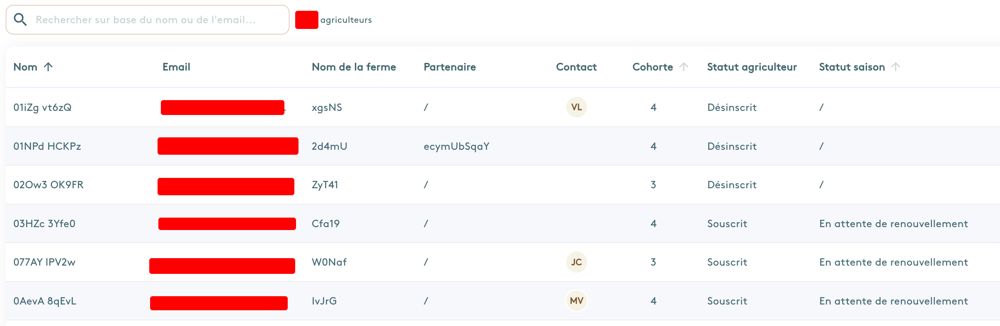
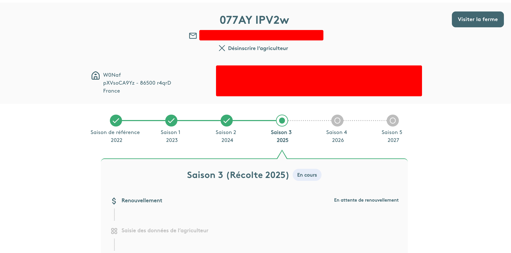

# Welcome

Below you'll find the instructions to complete this technical assignment.

May the force be with you.

PS: If you have questions, feel free to contact David at d.boulard@soilcapital.com

# How to

* Fork the repository and make your changes in your own private fork
* Open a Pull Request to the base repository

## What needs to be done

### Context

Good news everyone !

SoilCapital is booming and it is now time to provide our dearest agronomists a way to quickly assess the situation of a farm.

Your mission is to provide them a way to display the list and profiles of the farmers who have subscribed to our 5 years programme to regenerate their soil.

    So far, our PM has identified 4 status.

* SUBSCRIBED: The farmer has subscribed to the baseline (reference year) or has renewed for a new season
* ACTIVE: The farmer is currently encoding the farm's data, or the carbon results generation are on their way
* COMPLETED: The season is finalized. Carbon results have been generated, the farm is either being audited or the farm has received their carbon payment thanks to their practices improvements
* INACTIVE: The season has not started yet

### Frontend

* Be a hacker: find a way to successfully login to the app - hint: no code change needed. => password = hU3HUAy^yf97 and to find a valid user email => https://jsonplaceholder.typicode.com/users
* Be a saviour: fix a bug in the app.  Each time we refresh the page, we're back to the login screen.  Fix it so we stay on the current page.
* Be a builder: add two new pages to the app in order to
  * Fetch the farms from the backend in this repo to display a list showing the farm's name as well as the status of their latest season
  * Display the farm profile when clicking on one of the farms of the list. The profile should include :
    * The farm name
    * A timeline showing the various seasons of the farm and the status of each farm

Here are some screenshots of the current implementation for *inspiration*

### Backend

* Be an architect: Given the database schema shown in the Prisma file, implement a structure and the endpoints allowing a client to retrieve a list of farms, and the details of the farm

### Addendum

* It is not required to implement the login mechanism, the authorization middleware, the token validation nor any of that jazz in the backend
* Unit and Integration Tests - in this case - are not expected
* Screenshots are provided to give you some inspiration and clarity. It is not expected to follow them to the pixel perfection or alter the schema to fit them
* If you can't complete all tasks, focus on the parts you find most interesting or important, and explain your choices
* Please document any assumption either in the code or in the PR
* Please don't be afraid to contact us if you encounter an issue or if you feel you lack information required to complete this assignment
